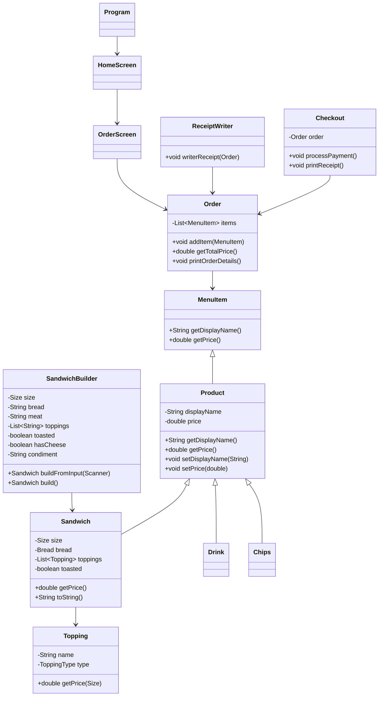

```mermaid
classDiagram
    class MenuItem{
        +String getDisplayName()
        +double getPrice()
    }

class Product{
    -String displayName
    -double price
    +String getDisplayName()
    +double getPrice()
    +void setDisplayName(String)
    +void setPrice(double)
}

class Sandwich {
    -Size size
    -Bread bread
    -List~Topping~ toppings
    -boolean toasted
    +double getPrice()
    +String toString()
}

class Topping {
    -String name
    -ToppingType type
    +double getPrice(Size)
}

class Order {
    -List~MenuItem~ items
    +void addItem(MenuItem)
    +double getTotalPrice()
    +void printOrderDetails()
}

class SandwichBuilder {
    -Size size
    -String bread
    -String meat
    -List~String~ toppings
    -boolean toasted
    -boolean hasCheese
    -String condiment
    +Sandwich buildFromInput(Scanner)
    +Sandwich build()
}

class Drink
class Chips
class Checkout {
    -Order order
    +void processPayment()
    +void printReceipt()
}

class ReceiptWriter {
    +void writerReceipt(Order)
}

    class OrderScreen
    class HomeScreen
    class Program

%% These are my inheritances
MenuItem <|-- Product
Product <|-- Sandwich
Product <|-- Drink
Product <|-- Chips

%% My parent classes
Sandwich --> Topping
Order --> MenuItem
Checkout --> Order
ReceiptWriter --> Order
OrderScreen --> Order
HomeScreen --> OrderScreen
Program --> HomeScreen
SandwichBuilder --> Sandwich
```